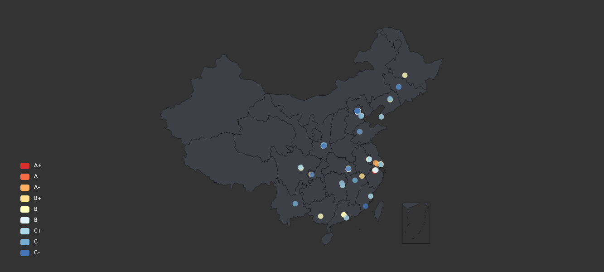
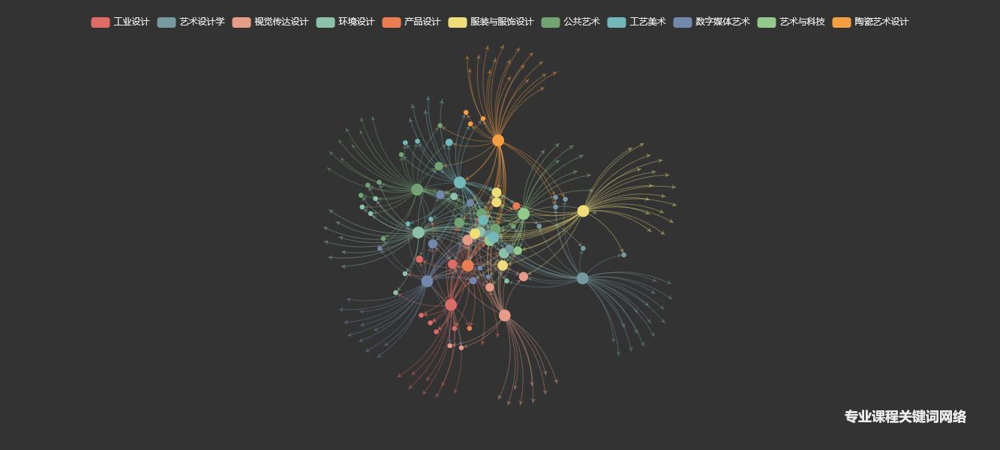

# design_courses

An analysis for the Chinese design courses in undergraduate of 65 universities. The project shows the visualization part of the analyzing result in interative web style, while the raw data for design courses are not available.

Here shows a part of screenshot for the visualization and you can see the whole result in index.html.

